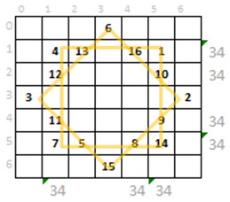
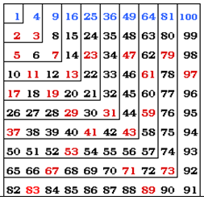

#. :math:`S = {\displaystyle \sum _{k=1}^n k}`, telle que :math:`0 \leq S \leq n^2`

Définissez des fonctions qui représentent les deux parties de l'équatio pour vérifier que

#. :math:`\sum _{{k=1}}^{n}k^{2}={\frac  {(2n+1)(n+1)n}6}`.
#. :math:`{\displaystyle \sum _{k=1}^{n}k^{3}={\frac {n^{2}(n+1)^{2}}{4}}}`
#. :math:`{\displaystyle \sum _{k=1}^{n}k^{4}={\frac {n}{30}}(n+1)(2n+1)(3n^{2}+3n-1)}`
#. :math:`\sum _{{k=0}}^{n}{\displaystyle \left(^{n}_{k}\right)}=2^{n}`
#. :math:`\sum _{{i=k}}^{{n-1}}{\binom  {i}{k}}={\binom  {n}{k+1}}`
#. :math:`\sum _{{i=0}}^{n}k\cdot \ i={k\cdot \ n(n+1) \over 2}`
#. :math:`\sum _{{i=1}}^{n}(2i-1)=n^{2}.`
#. :math:`\sum _{{i=0}}^{n}x^{i}={\frac  {1-x^{{n+1}}}{1-x}}`, pour x != 0

.. #. :math:``

* :math:`m = \displaystyle \frac{\sum_{i=1}^n x_i}{n}.`
* :math:`\sigma = \sqrt{\sum_{i=1}^n \frac{(x_i-m)^2}{n-1}}`
* :math:`x' = \frac{\sigma'}{\sigma} (x - m) + m'.`

-------

La somme peut être définie récursivement comme suit

:math:`{\displaystyle \sum _{i=a}^{b}g(i)=0}`, pour b < a

:math:`{\displaystyle \sum _{i=a}^{b}g(i)=g(b)+\sum _{i=a}^{b-1}g(i)}`, pour b >= a

------

DS MPSI 1 & MPSI3
------------------

Question 4.	Ecrire une fonctionretourne True si le tableau T représente une étoile magique comme celle présentée dans l'illustration.

.. code:: python

    def etoileMagique(T)-> bool:

Question 5.	Ecrire une fonction qui retourne la somme des éléments d'un segment entre (i_d,j_d), et (i_f,j_f), avec:

*	i_d ligne de début
*	j_d colonne de début
*	i_f ligne de fin
*	j_f colonne de fin

(*sans faire appel aux autres fonctions)

.. code:: python

    def sommeSegment(id, j_d, i_f, j_f):

Question 6.	Ecrire une procédure qui permet de remplir un tableau comme dans l'illustration (cf. Figure 2 tableau T de 100 entiers). en combinant les codes des procédures précédentes (sans faire appel à ces procédures). en utilisant la boucle while.

.. code:: python

    def remplissage2(tab):

----

#. Définissez une fonction qui retourne la liste des nombres d'occurrences de chaque lettre *car* dans un texte *texte*.
#. Définissez une fonction qui prend un *texte* et retourne une version sans doublons du texte *texte*.
