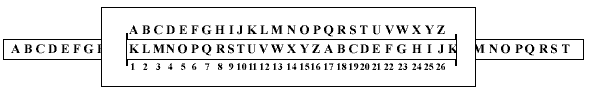

Tp5 - Les chaînes de caractères
===============================

TAF
----

    #. Définissez une fonction avautk(lettre: str) -> str qui code une lettre en utilisant le code 'a' vaut 'k' (a->k)
    #. Définissez une fonction codeavautk(texte: str) -> str qui code un texte en utilisant le code 'a' vaut 'k' (a->k)
    #. Définissez une fonction k7(lettre: str) -> str qui code une lettre en utilisant le code k7 (k->7)
    #. Définissez une fonction codek7(texte: str) -> str qui code un texte en utilisant le code k7 (k->7)

Cesar
-----
    #. Définissez une fonction cesar(lettre: str, rotation: int) -> str qui code une lettre en utilisant le code cesar
    #. Définissez une fonction codek7(texte: str, rotation: int) -> str qui code un texte en utilisant le code cesar

Cryptanalyse
------------
    #. Définissez une fonction cryptanalyse(texte: str) -> str qui casse le code césar et affiche le texte en clair.
  
Spécifications
--------------

    .. automodule:: tp5
        :members: